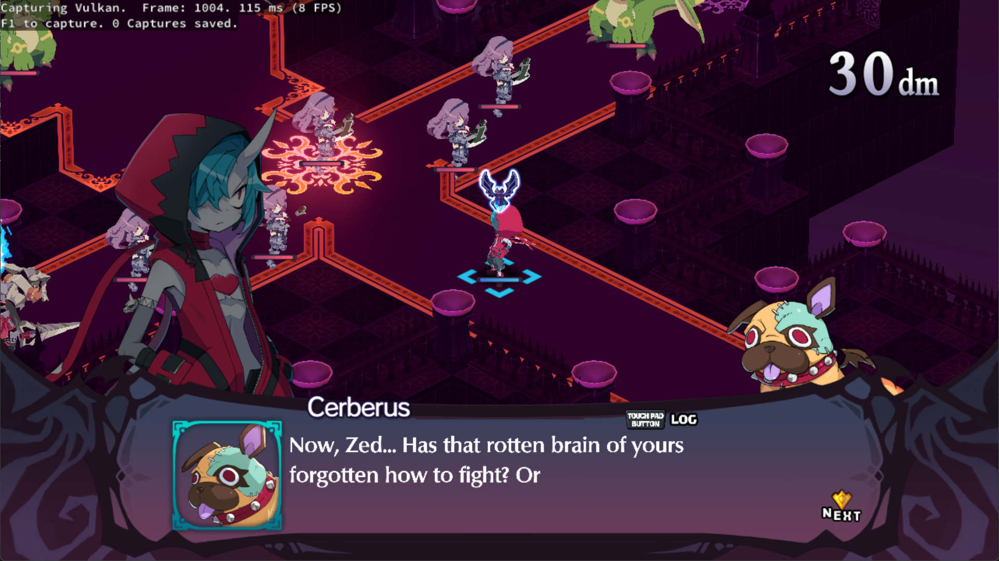
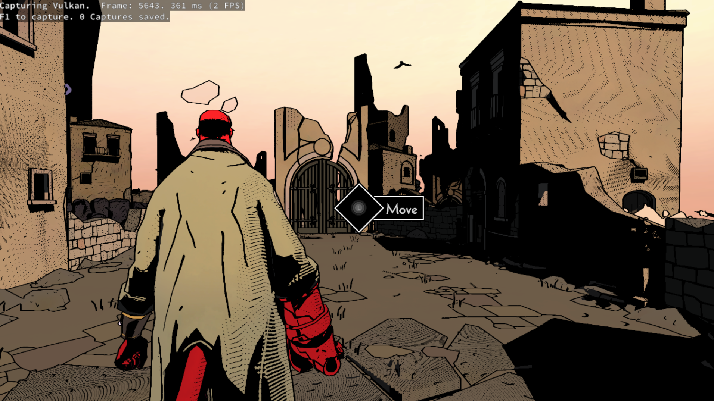
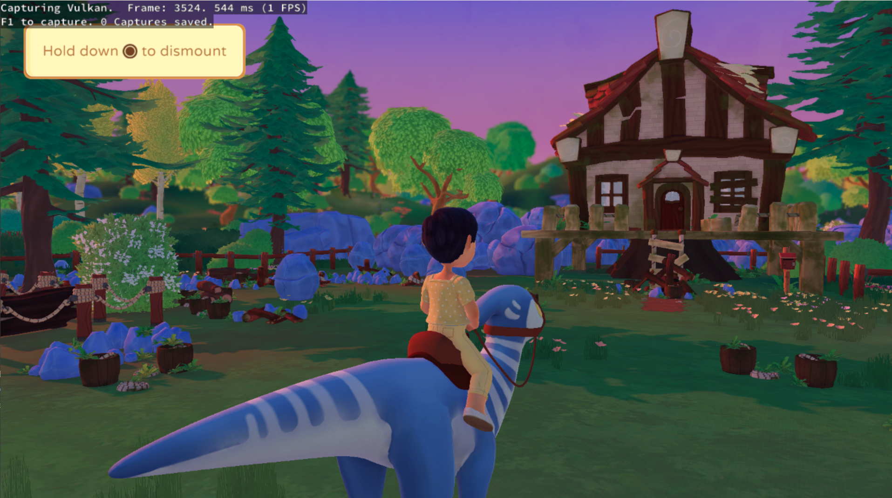

# Prosperismo

<p align="center">
  
</p>

[](#system-requirements)
[](#current-status)
[](LICENSE)

Prosperismo is a free and open-source PlayStation 5 emulator written in C++ for Windows and Linux,
with experimental macOS support. It is based on a heavily modified version of
[Kyty](https://github.com/InoriRus/Kyty). The project is in an early stage of development, so
compatibility is limited and behavior may change significantly between builds.

> [!IMPORTANT]
> Prosperismo is not affiliated with Sony Interactive Entertainment or PlayStation. The project does
> not distribute games or copyrighted system software. Use only game files that you have obtained
> legally.

## Current Status

Prosperismo can boot 2D games and a selection of 3D games, including titles built with Unreal Engine
4/5, Unity, and custom engines. No external low-level emulation modules are currently required.

Development is focused on compatibility and boot reliability.

Windows is the primary platform and receives the most testing. Linux builds and runs; see
[Building on Linux](#building-on-linux).

macOS support is experimental. The emulator is built for x86-64 and runs on Apple Silicon under
Rosetta 2, with Vulkan provided by MoltenVK. A small number of titles have been verified in-game
on Apple Silicon hardware; see [Building on macOS](#building-on-macos).

## Bugs and Issues

The project is in an early stage, so please be mindful when opening new issues. Expect crashes,
graphical glitches, low compatibility, and poor performance.

## Screenshots

<table align="center">
  <tr>
    <td align="center">
      <strong>Disgaea 6</strong><br>
      
    </td>
    <td align="center">
      <strong>Dreaming Sarah</strong><br>
      
    </td>
  </tr>
  <tr>
    <td align="center">
      <strong>Neptunia ReVerse</strong><br>
      
    </td>
    <td align="center">
      <strong>SILENT HILL: The Short Message</strong><br>
      
    </td>
  </tr>
  <tr>
    <td align="center">
      <strong>Hellboy</strong><br>
      
    </td>
    <td align="center">
      <strong>Paleo Pines</strong><br>
      
    </td>
  </tr>
</table>

<p align="center"><em>And many more...</em></p>

## Contributing

Testing games and submitting detailed bug reports are useful ways to contribute. Search existing
issues first, then use the **Game Emulation Bug Report** template and attach the complete log file.

Code contributions should be focused, build successfully on the platforms they touch, and include
relevant tests where practical. Windows is the primary target, so a change that alters shared code
should not regress it; changes confined to a platform's own code paths only need to build there. Because Prosperismo is still evolving quickly, consider opening an issue before
starting a large change.

### Formatting

Set up the clang-format hook after cloning:

```powershell
python -m pip install pre-commit
python -m pre_commit install --install-hooks
```

It formats staged `.cpp`, `.h`, and `.inc` files in `src`.

## Developer Information

The PS5 graphics architecture is based on AMD RDNA 2. Use AMD's
[RDNA 2 Instruction Set Architecture Reference Guide (document 70648)](https://docs.amd.com/v/u/en-US/rdna2-shader-instruction-set-architecture)
as the primary instruction-encoding reference when working on shader decoding and recompilation.

Important areas of the codebase:

- [`src/graphics/shader/recompiler`](src/graphics/shader/recompiler) — instruction decoding,
  intermediate representation, control flow, resource tracking, and SPIR-V emission
- [`src/graphics/guest_gpu`](src/graphics/guest_gpu) — PS5 (Prospero) GPU formats and command processing
- [`src/graphics/host_gpu`](src/graphics/host_gpu) — Vulkan host backend and resource management
- [`tests`](tests) — focused memory, shader, and resource-tracking regression tests

The renderer targets Vulkan 1.3. Keep shader changes aligned with both the RDNA 2 ISA semantics and
the Vulkan/SPIR-V validation rules.

## Building

### System requirements

- Windows 10 version 1803, a current Linux distribution, or macOS on Apple Silicon
- A 64-bit x86 processor (on macOS, an Apple Silicon processor with Rosetta 2)
- A Vulkan 1.3-capable GPU with current drivers (on macOS, Vulkan is provided by the bundled
  MoltenVK)

### Build requirements (Windows)

- Git
- CMake 3.12 or newer
- Ninja
- Visual Studio 2022 or Build Tools 2022 with the **Desktop development with C++** workload and
  **C++ Clang tools for Windows** component
- Qt 6 for MSVC 2022 64-bit, including Concurrent, Network, and Widgets

The Microsoft C++ compiler (`cl.exe`) is not supported; use `clang-cl`.

Open an **x64 Native Tools Command Prompt for Visual Studio 2022** (or the equivalent Developer
PowerShell), change to the repository root, and initialize the dependencies:

```powershell
git submodule update --init --recursive
```

Configure the project. Replace the Qt path with the version installed on your system:

```powershell
cmake -S src -B _Build/windows -G Ninja -DCMAKE_BUILD_TYPE=Release -DCMAKE_C_COMPILER=clang-cl -DCMAKE_CXX_COMPILER=clang-cl -DCMAKE_PREFIX_PATH="C:/Qt/6.x.x/msvc2022_64"
```

Build the launcher and stage a runnable installation:

```powershell
cmake --build _Build/windows --target launcher
cmake --install _Build/windows --prefix _Build/windows/install
```

The finished application and its runtime dependencies will be placed in
`_Build/windows/install`.

### Building on Linux

Install the toolchain and the libraries the bundled SDL2 needs. Without the audio, Wayland and
udev development packages SDL2 quietly configures itself without those backends, and the resulting
build has no working sound and no gamepad hotplug:

```bash
sudo apt-get install --no-install-recommends \
  clang lld ninja-build cmake git glslang-tools \
  libgl1-mesa-dev libx11-dev libxcursor-dev libxext-dev libxfixes-dev \
  libxi-dev libxrandr-dev libxss-dev libxkbcommon-dev \
  libasound2-dev libpulse-dev libudev-dev libdbus-1-dev libwayland-dev wayland-protocols
```

Qt 6 (Concurrent, Network, Widgets) is also required — either the distribution packages
(`qt6-base-dev`) or an official Qt installation.

```bash
git submodule update --init --recursive

cmake -S src -B _Build/linux -G Ninja -DCMAKE_BUILD_TYPE=Release \
  -DCMAKE_C_COMPILER=clang -DCMAKE_CXX_COMPILER=clang++ \
  -DCMAKE_PREFIX_PATH="$Qt6_DIR"

cmake --build _Build/linux --target launcher --parallel
cmake --install _Build/linux --prefix _Build/linux/install
```

The install step copies the Qt libraries and plugins next to the binaries, so
`_Build/linux/install` runs without a matching system Qt.

As on Windows, the MSVC compiler is not used; Clang is required. `cl.exe` is rejected at configure
time.

Note that the CMake source root is `src`, not the repository root.

### Building on macOS

macOS builds target x86-64 and run under Rosetta 2 on Apple Silicon, so the PS5's x86-64 game
code executes through the same translation layer as the emulator itself. Prebuilt archives are
attached to releases; the steps below are for building from source.

Requirements:

- An Apple Silicon Mac with Rosetta 2 installed (`softwareupdate --install-rosetta`)
- Xcode (or the Command Line Tools)
- Homebrew packages: `brew install cmake ninja glslang`
- Qt 6 (Concurrent, Network, Widgets) with x86-64 support. The official Qt installation is
  universal and works; Homebrew's Qt is arm64-only and will not link

```bash
git submodule update --init --recursive

cmake -S src -B _Build/macos -G Ninja -DCMAKE_BUILD_TYPE=Release \
  -DCMAKE_OSX_ARCHITECTURES=x86_64 \
  -DCMAKE_C_COMPILER=clang -DCMAKE_CXX_COMPILER=clang++ \
  -DCMAKE_PREFIX_PATH="$Qt6_DIR"

cmake --build _Build/macos --target launcher --parallel
cmake --install _Build/macos --prefix _Build/macos/install
```

The build re-signs `prosperismo_emulator` with the JIT entitlements it needs to execute translated
guest code; no manual signing step is required.

Vulkan comes from MoltenVK. Download `MoltenVK-macos.tar` from the
[MoltenVK releases](https://github.com/KhronosGroup/MoltenVK/releases), then copy
`MoltenVK/dynamic/dylib/macOS/libMoltenVK.dylib` next to `prosperismo_emulator` and ad-hoc sign it:

```bash
codesign --force --sign - _Build/macos/install/libMoltenVK.dylib
```

Release archives already include a signed `libMoltenVK.dylib`.

### Regression tests

Build every regression executable and run the registered tests with:

```powershell
cmake --build _Build/windows --target prosperismo_tests
ctest --test-dir _Build/windows --output-on-failure
```

Use `_Build/linux` instead of `_Build/windows` for a Linux build.

### Visual Studio Code

A ready-made Visual Studio Code setup is included in [`.vscode`](.vscode). It configures CMake
Tools to build the native core with Ninja and `clang-cl`. The Windows launcher is the separate
React Native project under [`frontend/ProsperismoLauncher`](frontend/ProsperismoLauncher).

Before using it:

1. Install the **CMake Tools** and **C/C++** extensions in Visual Studio Code.
2. Update the `--game` path in [`.vscode/launch.json`](.vscode/launch.json) for the
   **Debug prosperismo_emulator** profile.
3. Open the repository in an x64 Visual Studio developer environment, configure the CMake project,
   and select a launch profile from **Run and Debug**.

## Running

Update your graphics driver before reporting rendering problems.

To validate and run the graphical launcher during development:

```powershell
cd frontend\ProsperismoLauncher
npm install
npm run windows
```

RNW 0.84 requires Visual Studio 18.6+/v145 for native packaging. On first launch, add one or more game folders in the global settings. The launcher searches those
folders recursively for game directories containing `eboot.bin`. Select a detected game and run it
from the game list.

The emulator can also be started directly with a legally obtained game directory or ELF file:

```powershell
.\_Build\windows\install\prosperismo_emulator.exe --game "D:\Games\ExampleGame"
```

```bash
./_Build/linux/install/prosperismo_emulator --game "/games/ExampleGame"
```

On macOS, point SDL at the MoltenVK library explicitly; the hardened runtime prevents it from
being picked up from the executable's directory:

```bash
cd _Build/macos/install
SDL_VULKAN_LIBRARY="$PWD/libMoltenVK.dylib" ./prosperismo_emulator --game "/games/ExampleGame"
```

Run `prosperismo_emulator --help` to see the available graphics, logging, validation, profiling, and
debugging options.

### AI Use

AI tools may be used for research, reverse engineering, and development assistance. Contributors
must fully understand, review, and test all code they submit and remain responsible for its
correctness. Repository communication, including pull-request descriptions, code comments, and
issue comments, must come from the human contributor rather than an autonomous AI agent.

Pull requests that include AI-assisted or AI-generated work should disclose the scope of the AI
involvement and describe the human review and testing performed before submission. Unverified or
untested generated changes may be closed without review.

## License

Prosperismo is licensed under the [GNU General Public License version 2](LICENSE)
(`GPL-2.0-only`).

This project is based on the original [Kyty](https://github.com/InoriRus/Kyty), which was released
under the MIT License. Kyty's original copyright and license notice are preserved in
[`LICENSES/Kyty-MIT.txt`](LICENSES/Kyty-MIT.txt). Third-party components remain subject to the
licenses included with those components.

## Special Thanks

- [InoriRus/Kyty](https://github.com/InoriRus/Kyty) — Prosperismo descends from KytyPS5, itself a heavily modified version
  of the original Kyty project.
- [shadps4-emu/shadPS4](https://github.com/shadps4-emu/shadPS4) — reference for memory-model
  understanding and the AVPlayer implementation.
